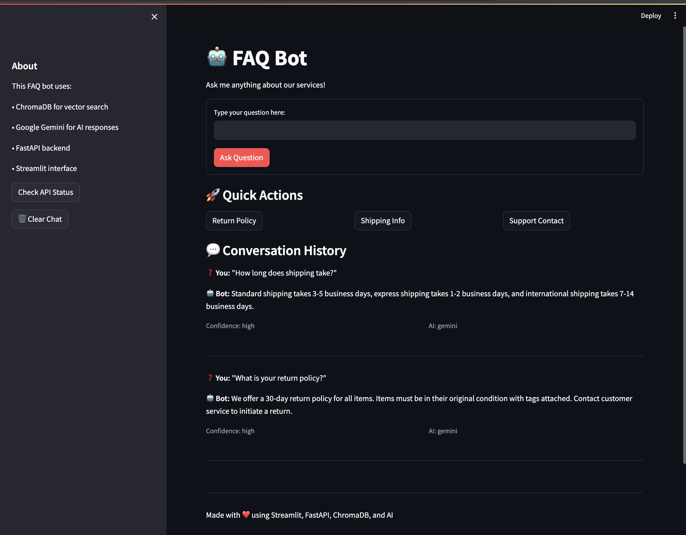

# 🤖 AI FAQ Bot - Intelligent Customer Support System

[](https://www.python.org/downloads/)
[](https://fastapi.tiangolo.com/)
[](https://streamlit.io/)
[](https://www.docker.com/)
[](LICENSE)

A production-ready AI-powered FAQ bot that combines semantic search with intelligent response generation. Built with modern AI technologies including vector databases, multiple LLM providers, and comprehensive monitoring.

## 🌟 **Key Features**

### 🧠 **Advanced AI Capabilities**

- **Semantic Search**: Understanding meaning, not just keywords using ChromaDB vector database
- **Multi-AI Support**: OpenAI GPT-3.5 + Google Gemini with intelligent fallback
- **Context-Aware Responses**: Natural, conversational answers powered by RAG architecture
- **Smart Fallback System**: Ensures users always get helpful responses

### 🏗️ **Production Architecture**

- **RESTful API**: FastAPI backend with automatic documentation
- **Modern Frontend**: Beautiful Streamlit interface with dark theme
- **Vector Database**: ChromaDB for lightning-fast semantic similarity search
- **Containerized**: Docker deployment for consistent environments
- **Monitoring**: LangSmith integration for AI observability and analytics

### 🚀 **Enterprise Features**

- **Rate Limiting**: Prevents abuse and controls costs
- **Error Handling**: Graceful degradation and comprehensive logging
- **Health Checks**: API monitoring and status endpoints
- **Scalable Design**: Ready for production deployment
- **Cost Optimization**: Free-tier friendly with usage controls

## 🎯 **Demo**



**Sample Questions to Try**:

- "What is your return policy?"
- "How long does shipping take?"
- "What payment methods do you accept?"
- "Help me track my order"

## 🛠️ **Technology Stack**

### **Backend Technologies**

| Component           | Technology                    | Purpose                        |
| ------------------- | ----------------------------- | ------------------------------ |
| **API Framework**   | FastAPI                       | High-performance REST API      |
| **Vector Database** | ChromaDB                      | Semantic search and embeddings |
| **AI Models**       | OpenAI GPT-3.5, Google Gemini | Natural language generation    |
| **Monitoring**      | LangSmith                     | AI observability and analytics |
| **Embedding Model** | all-MiniLM-L6-v2              | Text-to-vector conversion      |

### **Frontend & DevOps**

| Component                  | Technology            | Purpose                   |
| -------------------------- | --------------------- | ------------------------- |
| **UI Framework**           | Streamlit             | Interactive web interface |
| **Containerization**       | Docker                | Consistent deployment     |
| **Cloud Platform**         | Google Cloud Platform | Scalable hosting          |
| **Environment Management** | Docker Compose        | Local development         |

## 🚀 **Quick Start**

### **Option 1: Docker (Recommended)**

```bash
# Clone the repository
git clone https://github.com/yourusername/ai-faq-bot.git
cd ai-faq-bot

# Set up environment variables
cp .env.example .env
# Edit .env with your API keys

# Build and run with Docker
docker build -t faq-bot .
docker run -p 8000:8000 --env-file .env faq-bot

# Access the API
open http://localhost:8000

# Run Streamlit frontend (in another terminal)
cd frontend
pip install -r requirements.txt
streamlit run app.py
```

### **Option 2: Local Development**

```bash
# Backend setup
cd backend
python -m venv venv
source venv/bin/activate  # On Windows: venv\Scripts\activate
pip install -r requirements.txt
python main.py

# Frontend setup (in another terminal)
cd frontend
python -m venv venv
source venv/bin/activate
pip install -r requirements.txt
streamlit run app.py
```

## ⚙️ **Configuration**

### **Environment Variables**

Create a `.env` file in the project root:

```env
# AI Model API Keys
GOOGLE_API_KEY=your_google_gemini_api_key
OPENAI_API_KEY=your_openai_api_key_optional

# LangSmith Monitoring (Optional)
LANGCHAIN_API_KEY=your_langsmith_api_key
LANGCHAIN_PROJECT=faq-bot
LANGCHAIN_TRACING_V2=true
LANGCHAIN_ENDPOINT=https://api.smith.langchain.com

# Application Settings
ENVIRONMENT=development
DEBUG=true
```

### **Getting API Keys**

1. **Google Gemini API**:

   - Visit [Google AI Studio](https://makersuite.google.com/app/apikey)
   - Free tier: 60 requests/minute

2. **OpenAI API** (Optional):

   - Visit [OpenAI Platform](https://platform.openai.com/api-keys)
   - Pay-per-use pricing

3. **LangSmith** (Optional):
   - Visit [LangSmith](https://smith.langchain.com/)
   - Free tier: 5,000 traces/month

## 🏗️ **Architecture Overview**

```
┌─────────────────┐    ┌─────────────────┐    ┌─────────────────┐
│   Streamlit     │    │    FastAPI      │    │   ChromaDB      │
│   Frontend      │───▶│    Backend      │───▶│ Vector Database │
│                 │    │                 │    │                 │
└─────────────────┘    └─────────────────┘    └─────────────────┘
                              │
                              ▼
┌─────────────────┐    ┌─────────────────┐    ┌─────────────────┐
│   LangSmith     │    │  AI Models      │    │   User Query    │
│   Monitoring    │◀───│ OpenAI/Gemini   │◀───│   Processing    │
│                 │    │                 │    │                 │
└─────────────────┘    └─────────────────┘    └─────────────────┘
```

### **Data Flow**

1. **User Input**: Question submitted via Streamlit interface
2. **Vector Search**: ChromaDB finds semantically similar FAQs
3. **Context Creation**: Relevant FAQs assembled as context
4. **AI Generation**: OpenAI/Gemini generates natural response
5. **Response Delivery**: User receives conversational answer
6. **Monitoring**: LangSmith tracks performance and costs

## 📊 **Project Structure**

```
ai-faq-bot/
├── 📁 backend/
│   ├── 🐍 main.py              # FastAPI application
│   ├── 🗄️ database.py          # ChromaDB integration
│   ├── 📊 langsmith_config.py  # AI monitoring setup
│   └── 📋 requirements.txt     # Backend dependencies
├── 📁 frontend/
│   ├── 🎨 app.py              # Streamlit interface
│   └── 📋 requirements.txt     # Frontend dependencies
├── 📁 data/
│   └── 📄 faq_data.json       # FAQ knowledge base
├── 📁 deployment/
│   ├── 🐳 Dockerfile          # Container configuration
│   ├── ☁️ app.yaml            # GCP App Engine config
│   └── 🔧 docker-compose.yml  # Local development
├── 📄 README.md               # This file
├── 🔒 .env.example            # Environment template
└── 📝 requirements.txt        # Root dependencies
```

## 🔧 **API Documentation**

Once running, visit:

- **Interactive API Docs**: http://localhost:8000/docs
- **API Schema**: http://localhost:8000/redoc

### **Key Endpoints**

| Endpoint            | Method | Description                 |
| ------------------- | ------ | --------------------------- |
| `/ask`              | POST   | Main FAQ query endpoint     |
| `/health`           | GET    | System health check         |
| `/faqs`             | GET    | List all available FAQs     |
| `/debug`            | GET    | System debugging info       |
| `/test-gemini`      | POST   | Test Gemini AI specifically |
| `/monitoring/stats` | GET    | AI monitoring statistics    |

### **Example API Usage**

```bash
# Ask a question
curl -X POST "http://localhost:8000/ask" \
  -H "Content-Type: application/json" \
  -d '{"question": "What is your return policy?"}'

# Check system health
curl "http://localhost:8000/health"
```

## 🌩️ **Cloud Deployment**

### **Google Cloud Platform (Free Tier)**

#### **Option 1: App Engine (Recommended)**

```bash
# Setup
gcloud init
gcloud projects create your-faq-bot-project
gcloud config set project your-faq-bot-project
gcloud services enable appengine.googleapis.com

# Deploy
gcloud app deploy deployment/app.yaml

# View
gcloud app browse
```

**Free Tier Benefits**:

- 28 instance hours/day (FREE)
- Automatic scaling to zero
- Built-in load balancing

#### **Option 2: Cloud Run**

```bash
# Deploy container
gcloud run deploy faq-bot \
  --source . \
  --platform managed \
  --region us-central1 \
  --allow-unauthenticated \
  --memory 512Mi \
  --max-instances 1
```

**Free Tier Benefits**:

- 2M requests/month (FREE)
- Pay-per-request model
- Scales to zero automatically

### **Environment Variables for Production**

```bash
# Set production environment variables
gcloud app deploy --set-env-vars \
  GOOGLE_API_KEY=your_key,\
  LANGCHAIN_API_KEY=your_key,\
  ENVIRONMENT=production
```

## 📈 **Monitoring & Analytics**

### **LangSmith Dashboard Features**

- 📊 **Performance Metrics**: Response times, success rates
- 💰 **Cost Tracking**: Token usage and API costs per model
- 🔍 **Conversation Tracing**: Full request/response logs
- 🎯 **A/B Testing**: Compare AI model performance
- 📝 **User Feedback**: Collect and analyze user ratings

### **Key Metrics to Monitor**

- **Response Quality**: User satisfaction scores
- **Performance**: Average response time < 2s
- **Cost Efficiency**: Cost per successful query
- **Error Rates**: Failed requests < 5%
- **Usage Patterns**: Peak usage times and popular queries

## 🧪 **Testing**

### **Manual Testing Checklist**

- [ ] Basic FAQ queries work correctly
- [ ] AI fallback system functions
- [ ] Rate limiting prevents abuse
- [ ] Error handling graceful
- [ ] Monitoring captures data

## 🔒 **Security & Best Practices**

### **API Security**

- Rate limiting on all endpoints
- Input validation and sanitization
- Environment variable protection
- CORS properly configured

### **Data Privacy**

- No user data stored permanently
- API keys secured in environment variables
- Conversation logs can be disabled

### **Production Considerations**

- Health checks for monitoring
- Graceful error handling
- Automatic failover between AI models
- Cost monitoring and alerts

## 🎯 **Use Cases & Applications**

### **Business Applications**

- **Customer Support**: 24/7 automated first-line support
- **Internal Help Desk**: Employee self-service portal
- **Product Documentation**: Interactive user guides
- **Sales Support**: Pre-sales question automation

### **Technical Applications**

- **API Documentation**: Interactive developer support
- **Troubleshooting**: Automated technical support
- **Knowledge Base**: Searchable company information
- **Training**: Employee onboarding assistance

### **Development Setup**

1. Fork the repository
2. Create a feature branch
3. Make your changes
4. Add tests for new functionality
5. Submit a pull request

## 🏆 **Showcase**

This project demonstrates expertise in:

- **Modern AI Development**: RAG, vector databases, multi-model systems
- **Full-Stack Development**: API design, frontend development, containerization
- **Cloud Engineering**: GCP deployment, monitoring, cost optimization
- **Production Systems**: Error handling, monitoring, scalability
- **Developer Experience**: Documentation, testing, CI/CD

---

**⭐ If this project helped you, please give it a star! ⭐**

_Built with ❤️ using cutting-edge AI technologies_
